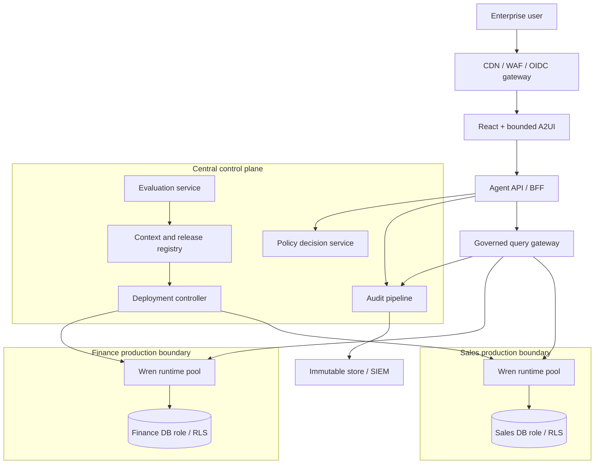

# Enterprise Wren Platform Design

| Field | Value |
|---|---|
| Status | Draft for architecture review |
| Scope | Enterprise analytics and GenBI platform built on Wren OSS |
| Owners | Platform Product, Data Platform, Security Architecture |
| Last updated | 2026-08-24 |
| Review cadence | Quarterly and after material Wren, ADK, identity, or policy changes |

## 1. Executive decision

Build a central **governance and control plane**, not a new version of the
deprecated Wren GenBI Classic monolith. Run Wren in a **federated data plane**:
runtime pools are isolated by environment, data domain, and security boundary.

Wren OSS is a replaceable semantic execution engine. Git is the source of truth
for business context, the warehouse is the final security enforcement point,
and the platform owns identity, lifecycle, policy, audit, evaluation,
deployment, and operations.

The current `wren-adk` application becomes an agent runtime and production BFF.
Google ADK Dev UI remains local-only. React/A2UI is the initial production
experience, but it is not a governance or security boundary.

### 1.1 Principles

1. Centralize governance; federate execution.
2. Treat semantic context as reviewed, signed, immutable release artifacts.
3. Derive identity server-side; never trust a browser-provided user ID.
4. Enforce authorization at the platform and again at the data source.
5. Attribute actions to a human, service, model, context, policy, and runtime.
6. Default to read-only, least privilege, bounded results, and fail closed.
7. Keep Wren behind an internal adapter so it can be upgraded or replaced.
8. Promote the same digest across environments; never rebuild in production.
9. Integrate existing IAM, catalog, policy, vault, CI, and SIEM capabilities.
10. Platform teams operate the service; domain owners remain accountable for
    meaning and permitted use.

## 2. Scope

### In scope

- Governed natural-language analytics and structured A2UI results.
- Multiple Wren MDL data products and data sources.
- Authoring, review, certification, release, promotion, rollback, deprecation,
  and retirement.
- Authentication, authorization, audit, lineage, retention, SLOs, DR, and cost.
- Governance of agents, prompts, models, tools, contexts, and policies.
- APIs for the first-party UI and approved enterprise integrations.

### Initial non-goals

- Rebuilding Wren Classic feature for feature.
- Replacing enterprise IAM, catalog, SIEM, or warehouse authorization.
- Arbitrary SQL outside a certified Wren context.
- Data mutation or autonomous business actions.
- Arbitrary HTML, JavaScript, remote resources, or unapproved A2UI components.
- One global credential or Wren runtime for the enterprise.

## 3. Current state and gaps

The repository demonstrates the full path:

```text
React/A2UI -> ADK HTTP/SSE -> LLM -> Wren MCP -> warehouse
```

It is not yet an enterprise platform:

- ADK Dev UI and development-oriented endpoints are embedded.
- Sessions, memory, and artifacts default to in-memory implementations.
- The React client creates its own user identifier.
- There is no production authentication, policy, or complete audit chain.
- Wren projects are mounted rather than selected from signed releases.
- There is no registry, evaluation service, deployment controller, or quota
  model.
- Wren MCP has process-local sessions and serialized query execution.
- Production health, SLO, backup, recovery, and incident controls are missing.

These are platform backlog items, not configuration omissions.

## 4. Target architecture



### Trust boundaries

| Boundary | Contains | Must not contain |
|---|---|---|
| Browser | UI state, short-lived session | Secrets, trusted user ID, raw policy |
| Edge | TLS, WAF, OIDC, coarse limits | Warehouse access |
| Agent | ADK runner, conversations, A2UI validation | Unrestricted database access |
| Control plane | Metadata, releases, policy, audit | Query datasets, long-lived DB secrets |
| Runtime | Wren workers and bounded DB identity | Cross-domain credentials |
| Warehouse | Data, secure views, RLS/CLS, query audit | Application session state |

## 5. Platform components

### 5.1 Enterprise edge

- Terminates TLS and integrates enterprise OIDC.
- Uses Authorization Code with PKCE or a secure BFF session.
- Applies WAF, request-size, connection, and per-subject limits.
- Serves UI and API on one origin where possible.
- Blocks Dev UI, debug, trace, and evaluation endpoints in production.

### 5.2 Agent API / BFF

- Replaces public `AdkWebServer` use with a supported production API.
- Maps the verified OIDC subject and groups to an internal principal.
- Owns durable conversations, turns, feedback, and streams.
- Selects only context releases allowed by policy.
- Calls LLMs through an approved provider gateway.
- Validates bounded A2UI before delivery.
- Emits correlated audit events for every turn and tool call.

Initial external API:

```text
POST /api/v1/conversations
GET  /api/v1/conversations/{id}
POST /api/v1/conversations/{id}/turns:stream
POST /api/v1/conversations/{id}/events
POST /api/v1/conversations/{id}/feedback
```

### 5.3 Context and release registry

Git remains the authoring source of truth. The registry stores searchable
metadata and immutable release references, not an editable copy of MDL.

Each project records:

- ID, domain, owner, steward, classification, purposes, region, and retention.
- Repository/path, certified versions, and promotion state.
- Signed context digest, Wren version, and MDL schema version.
- Supported roles, policy bundle, database identity, and runtime class.
- Evaluation evidence, approvers, release notes, and deprecation date.
- SLO class, cost center, on-call service, and incident contact.

### 5.4 Policy decision service

Evaluate versioned policy from the verified subject and groups, workload,
project, release, environment, classification, purpose, operation, tool, model,
and delivery channel. Return allow/deny plus obligations such as row limit,
masking, approved model, retention, or required approval. Audit the decision and
policy version.

Use the enterprise policy engine, such as OPA or Cedar. Authorization must not
live only in prompts.

### 5.5 Governed query gateway

This is the stable enterprise interface to Wren; agents do not connect to
arbitrary Wren endpoints.

- Validate workload identity and signed user delegation.
- Recheck policy immediately before execution.
- Resolve project digest to an eligible runtime pool.
- Pin HTTP MCP sessions to a worker by `mcp-session-id`.
- Enforce concurrency, timeout, row, byte, and cost limits.
- Emit query/tool audit events and normalize safe errors.
- Drain and reinitialize sessions during worker replacement.

Start with an MCP adapter, but keep the interface transport-neutral so a direct
Wren SDK adapter can replace it without changing agents or public APIs.

### 5.6 Wren runtime pools

A pool is scoped to one environment and security boundary:

```text
<environment>/<domain>/<classification>/<database-role>/<context-major-version>
```

| Class | Use | Trade-off |
|---|---|---|
| Isolated sidecar | Sensitive tenant, low latency, strong isolation | One DB connection/allocation per querying agent pod |
| Shared domain pool | Many mostly idle users in one policy boundary | Requires session pinning and queue-aware scaling |

Never use `ClientIP` affinity as authorization or stable routing. For shared
HTTP MCP, hash on the MCP session ID or keep an explicit session-worker map.

Runtime rules:

- Bind Wren to loopback for sidecars or an internal-only network for pools.
- Never expose Wren through public ingress.
- Disable `store_query` and other writes by default.
- Enable strict semantic enforcement and deny unsafe functions.
- Use one least-privileged DB identity per pool.
- Run immutable context artifacts and disposable workers.

### 5.7 Evaluation service

Release and continuous evaluations include:

- Strict MDL validation and build.
- Golden NL-to-SQL, result, metric, and join regression tests.
- Role matrix tests proving allowed and denied access.
- Prompt-injection, tool-abuse, and exfiltration cases.
- A2UI protocol, allowlist, event, size, and unsafe-content tests.
- Connector compatibility and representative performance tests.
- Model/prompt quality and cost comparisons.

Production feedback may propose examples; it never changes certified context
automatically. A steward reviews learning through Git.

## 6. Identity and security

### 6.1 Identity chain

```text
human -> browser session -> agent service -> query gateway
      -> Wren worker -> database role / warehouse session
```

The server derives `user_id`. Service calls use workload identity and a signed,
short-lived delegation containing the subject and approved purpose.

### 6.2 Authorization

Use RBAC for administration and ABAC/purpose policy for data:

- Operators may deploy certified artifacts but cannot certify Finance metrics.
- Stewards may approve definitions but cannot grant themselves warehouse access.
- Analysts cannot select uncertified releases or change DB identity.
- Service accounts are bound to projects, operations, environments, and quotas.
- Authors cannot solely approve material semantic or access changes they made.

### 6.3 Defense in depth

- Prefer warehouse-native RLS/CLS, secure views, masking, and query audit.
- If per-user identity cannot pass through Wren, split pools by policy group or
  use an SDK adapter with per-request properties. A gateway check alone is not
  fine-grained warehouse enforcement.
- Resolve short-lived secrets from the enterprise vault. Never store secrets in
  Git, MDL, prompts, logs, or images.
- Use workload identity, NetworkPolicy, encryption, and residency-aware routing.
- Log metadata by default; retain prompts, SQL, or results only under an
  explicit classified retention policy.

### 6.4 LLM, tools, and A2UI

- Allow approved providers/models per classification and define provider use,
  training, and retention contractually.
- Separate trusted policy/context from untrusted user and retrieved content.
- Treat database strings and documents as untrusted prompt content.
- Give the model only schema-bound allowlisted tools; never shell, credentials,
  arbitrary networking, or a semantic-layer bypass.
- Bound read time, rows, bytes, and concurrency. Future write/action tools need
  deterministic policy, idempotency, and human confirmation outside the LLM.
- Accept supported A2UI versions and reviewed catalog components only.
- Reject HTML, JavaScript, URLs, function calls, and oversized/deep payloads.
- Reauthorize every UI event; a rendered action grants no capability.

## 7. Context lifecycle and governance

```text
Draft -> In review -> Certified -> Released -> Deprecated -> Retired
```

| State | Meaning |
|---|---|
| Draft | Authoring only; no production access |
| In review | Automated gates passed; approvals pending |
| Certified | Meaning, access, and quality approved |
| Released | Signed artifact deployed to an environment |
| Deprecated | Existing use until deadline; no new consumers |
| Retired | Runtime removed; audit retained by policy |

### Required project contents

```text
wren_project.yml
models/
views/
relationships.yml
knowledge/
instructions.md
tests/
  golden-queries/
  semantic-regression/
  authorization/
  prompt-security/
metadata/
  ownership.yml
  classification.yml
  slo.yml
CHANGELOG.md
```

Connection files contain secret references, never values.

### Change approvals

| Change | Approval |
|---|---|
| Description, enum, non-normative example | Data steward |
| Metric, cube, relationship, join, or business rule | Domain owner + analytics engineer |
| Table/column exposure or classification | Data owner + security/privacy |
| Role, RLS/CLS, masking, or purpose policy | Security/IAM + data owner |
| Model, system prompt, or tool | AI governance + agent owner |
| Runtime, connector, or Wren version | Platform engineering + SRE |
| Breaking API/context release | Architecture owner + affected consumers |

Use semantic versioning. Breaking meaning/access changes require a major
version; compatible additions a minor version; non-contract corrections a patch.
Record platform, agent, prompt, policy, and context versions independently and
capture them together in deployments and audit events.

## 8. SDLC and supply chain

Four signed artifacts form a deployment:

1. **Platform image**: BFF, gateway, registry, or service code.
2. **Agent bundle**: agent, system prompt, tool catalog, and model policy.
3. **Context bundle**: project, compiled MDL, metadata, and test evidence.
4. **Policy bundle**: authorization rules and obligations.

The deployment manifest pins all four by digest.

```text
lint -> unit -> strict MDL validation -> build -> dry-plan
     -> golden/evals -> authorization -> security scans
     -> SBOM/provenance -> approval -> signed artifact
```

Required controls:

- Protected branches and CODEOWNERS.
- Short-lived CI identity and dependency locks.
- Vulnerability, secret, and license scans.
- SBOM, provenance, signing, and admission verification.
- Ephemeral integration tests with synthetic or approved masked data.
- GitOps-only production changes.

Promote the same digest through development, staging, canary, and production.
Rollback selects a previously certified manifest and verifies DB schema
compatibility; it never rebuilds an old release.

## 9. Audit and accountability

Every event distinguishes the human, workload, agent/prompt/model, context,
policy, Wren worker, database identity, data source, and any approver.

Minimum query event:

```json
{
  "event_id": "uuid",
  "occurred_at": "RFC3339 timestamp",
  "request_id": "uuid",
  "conversation_id": "uuid",
  "subject": {"id": "enterprise-id", "groups": ["finance-analyst"]},
  "workload": {"service": "agent-api", "version": "sha256:..."},
  "agent": {"id": "wren-analyst", "prompt_version": "3.2.0"},
  "model": {"provider": "approved-provider", "name": "approved-model"},
  "context": {"project": "finance", "version": "2.4.1", "digest": "sha256:..."},
  "policy": {"version": "2026.08.3", "decision": "allow", "obligations": []},
  "tool": {"name": "run_sql", "call_id": "...", "outcome": "success"},
  "data": {"source": "finance-warehouse", "role": "finance_reader", "row_count": 12},
  "sql": {"hash": "sha256:...", "protected_payload_ref": null},
  "a2ui": {"version": "v0.9.1", "components": ["Card", "Text"]},
  "duration_ms": 842,
  "error_code": null
}
```

Never place credentials or unrestricted results in audit events. Store permitted
raw evidence encrypted behind a separately audited reference. Also audit project
certification, policy/role changes, release/rollback, waivers, emergency access,
audit exports, and runtime administration.

Security audit events use durable ingestion with local buffering. If required
evidence cannot be accepted, fail closed; never silently drop it.

## 10. Scalability, availability, and operations

Benchmark every supported Wren release. Initial assumptions from current
research are:

```text
active analytical query capacity ~= healthy Wren workers
database connections ~= warm querying Wren workers
```

One Wren process currently serializes real queries through one connection.
Scale for peak warehouse query concurrency, not users or chats. Apply quotas and
queues before adding workers so scaling does not overload the warehouse.

- Scale Agent API by active turns, SSE connections, CPU, and queue delay.
- Scale Query Gateway by tool rate and routing queue.
- Scale Wren pools by active queries, worker queue, and warehouse budget.
- Isolate evaluation workers from interactive traffic.

Research suggests roughly 150-250 MiB per warmed Wren worker, but production
resources must come from repeatable tests for the pinned version and context.

### Sessions and availability

- Store ADK conversations/artifacts durably; pod memory is a cache.
- Store MCP session-worker mappings in a replicated low-latency store with TTL.
- Reinitialize Wren sessions after loss; drain turns and queries on rollout.
- Run control APIs across availability zones.
- Use HA relational metadata storage with point-in-time recovery.
- Replicate artifact registry and audit ingestion.
- Reconstruct runtime workers; do not restore local runtime disk.

Initial SLO proposals, subject to pilot validation:

| Capability | Target |
|---|---|
| Authenticated API availability | 99.9% monthly |
| Control-plane read availability | 99.9% monthly |
| Audit events durably accepted | 99.99%; zero silent loss |
| Platform overhead excluding LLM/warehouse | p95 below 500 ms |
| Certified rollback | Within 15 minutes |
| Control-plane RPO / RTO | 5 minutes / 60 minutes |

End-to-end latency and correctness targets are domain-specific.

### Telemetry and runbooks

Measure requests/SSE, LLM latency/tokens/cost, tool selection and failures,
Wren sessions/restarts/query queues, warehouse IDs/scan/rows, policy decisions,
A2UI validation, and context rollout/regression. Correlate with one request ID.
Production logs are structured and redacted; verbose ADK/MCP payloads stay off.

Runbooks cover Wren session loss, warehouse saturation, provider outage, bad
context release, audit failure, credential exposure, and exfiltration. Kill
switches independently disable a model, tool, context, policy, source, user, or
pool. Emergency access is time-bound, approved, attributable, and reviewed.

## 11. Ownership

| Role | Accountable for |
|---|---|
| Executive sponsor | Risk acceptance, funding, mandate |
| Platform product owner | Roadmap, service tiers, adoption, SLO priorities |
| Platform engineering | Control plane, APIs, adapter, developer experience |
| SRE | Availability, capacity, incidents, DR |
| Domain/data owner | Permitted use, access, business accountability |
| Data steward | Glossary, descriptions, classification, quality |
| Analytics engineer | MDL, metrics, joins, tests, releases |
| Agent/AI engineer | Agents, prompts, tools, A2UI, evaluations |
| Security/IAM | Identity, policy, threat model, controls |
| Privacy/legal | Purpose, residency, retention, regulated data |
| AI/model governance | Approved models, safety thresholds, changes |
| Internal audit | Independent evidence and control review |

People may cover multiple pilot roles, but each responsibility needs a named
owner and material changes retain separation of duties.

## 12. Upstream and licensing strategy

- Pin Wren versions/digests and run an upstream compatibility suite.
- Prefer adapters and upstream contributions over deep engine forks.
- Track releases, vulnerabilities, license-map changes, and package manifests.
- Preserve Apache-2.0 notices and all third-party obligations.
- Rebrand; do not use Wren/WrenAI names or logos as the platform identity.
- Independently implement features; do not copy commercial code or assets.
- Choose the license and contributor terms for new modules before accepting
  external contributions.

## 13. Delivery roadmap

### Phase 0: architecture and due diligence

- Approve threat model, data flow, license review, and build-vs-buy assessment.
- Select one domain, owner, steward, and pilot group.
- Select IAM, policy, catalog, vault, SIEM, and CI integrations.
- Measure baseline correctness, access, performance, and cost.

Exit with Security, Data Governance, Architecture, and domain-owner approval.

### Phase 1: controlled read-only pilot

- Production BFF with OIDC identity and durable sessions.
- One certified project and immutable context artifact.
- One isolated Wren boundary with a read-only DB role.
- Query gateway, policy, complete audit chain, and bounded A2UI.
- Golden, authorization, injection, and recovery tests.
- Dashboard, on-call owner, runbooks, quotas, and kill switches.

Exit after agreed correctness, security, audit, SLO, cost, and value targets hold
for an observation period.

### Phase 2: enterprise baseline

- Git-based self-service onboarding and reviewed templates.
- Registry, certification, evaluations, and deployment controller.
- Multiple domains, policy bundles, promotion, and chargeback.
- Multi-AZ, DR evidence, incident response, and deprecation lifecycle.

Exit when two independent domains operate without app forks or manual
production mutation.

### Phase 3: scale and ecosystem

- Shared pools with explicit session routing and queue-aware autoscaling.
- Additional agent frameworks behind the same governance.
- Delegated/short-lived warehouse identities.
- Regional and regulated-data isolation.
- Governed dashboard publishing and carefully controlled future action tools.

## 14. Risks

| Risk | Mitigation | Owner |
|---|---|---|
| Wren behavior changes | Pin, adapter, compatibility suite, planned upgrades | Platform |
| Process-local MCP sessions | Mapping, drain, reinitialize, no random routing | Platform |
| Serialized queries | Queue metrics, domain pools, budgets, load tests | SRE |
| Shared DB identity | RLS/delegation or policy-group pools | Security/Data |
| Incorrect semantics | CODEOWNERS, golden tests, certification, rollback | Domain owner |
| Prompt/tool abuse | Isolation, allowlists, limits, adversarial evals | AI governance |
| Sensitive LLM/log data | Provider controls, minimization, redaction, retention | Privacy/Security |
| Cost/warehouse saturation | Quotas, timeouts, scan budgets, chargeback | SRE/Product |
| Audit loss | Durable buffer, fail closed, reconciliation | Security/SRE |
| Fork burden | Thin adapter, upstream work, funded ownership | Product |
| License/trademark | Inventory, notices, rebranding, counsel | Legal/Platform |

## 15. Open decisions

1. OSS-only or evaluate Enterprise Plus in parallel?
2. Which policy engine and catalog are authoritative?
3. Can per-user identity pass through Wren, or must pools split by policy group?
4. Which durable ADK session and artifact implementation?
5. MCP adapter or direct Wren SDK for the query gateway?
6. Which LLM providers and regions per classification?
7. What prompt, SQL, result, and audit retention periods?
8. What license and contribution model for new platform modules?
9. What pilot quality threshold, SLO, RPO/RTO, and cost envelope?
10. What requires human approval if future actions are added?

## 16. Document maintenance

- Change this document by pull request with Platform, Security, and Data
  Architecture review.
- Update the date, decisions, risks, and roadmap with material changes.
- Record major decisions under `docs/adr/` and link them below.
- Review quarterly and before upgrading Wren, ADK, A2UI, LLM provider,
  identity, or policy models.
- Validate diagrams, API examples, version claims, and references in docs CI.

| ADR | Status | Decision |
|---|---|---|
| Pending | Proposed | Central control plane with federated Wren pools |
| Pending | Proposed | Git plus signed OCI context artifacts |
| Pending | Proposed | Query gateway as the enterprise Wren access path |

## 17. References

- [WrenAI repository](https://github.com/Canner/WrenAI)
- [WrenAI license map](https://github.com/Canner/WrenAI/blob/main/LICENSE)
- [Wren OSS documentation](https://docs.getwren.ai/oss/introduction)
- [Google ADK Java](https://github.com/google/adk-java)
- [A2UI](https://github.com/google/A2UI)
- Local research: `/data/Git/WrenAI-demo/docs/mcp-integration-and-scaling.md`
- Local research: `/data/Git/WrenAI-demo/docs/production-adoption.md`

